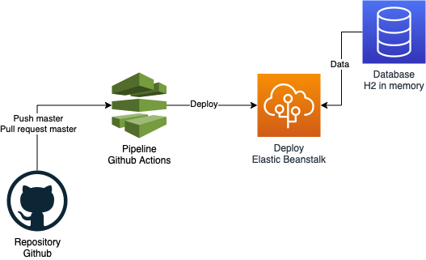

# tech-test-user-validation
Aplicación desarrollada con Spring boot para validar usuarios.

**Diagrama de la aplicación:**

**Endpoint test**

`curl --location --request POST 'http://ebsspringuservalidationtest-env.eba-7pdeyvst.us-east-1.elasticbeanstalk.com:8080/api/user' \
    --header 'Content-Type: application/json' \
    --data-raw '{"name": "cristian","email": "testtest@t.com","password": "22aaiIO$$","phones": [{"phone": "12313","cityCode": "1","countryCode": "1"}]}'`
